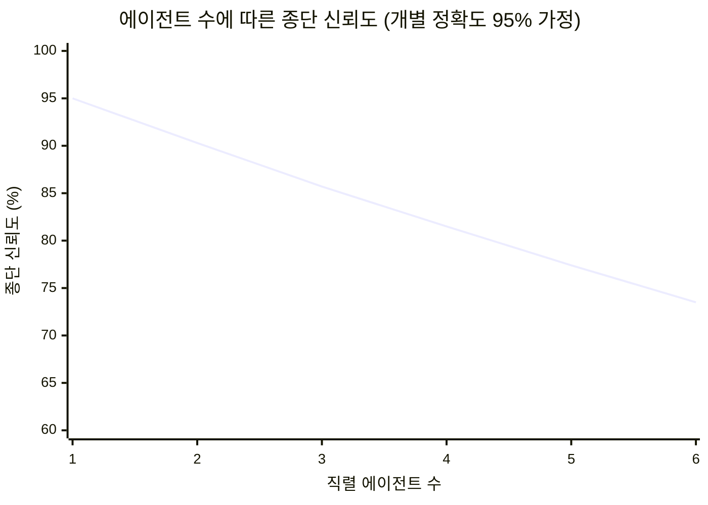
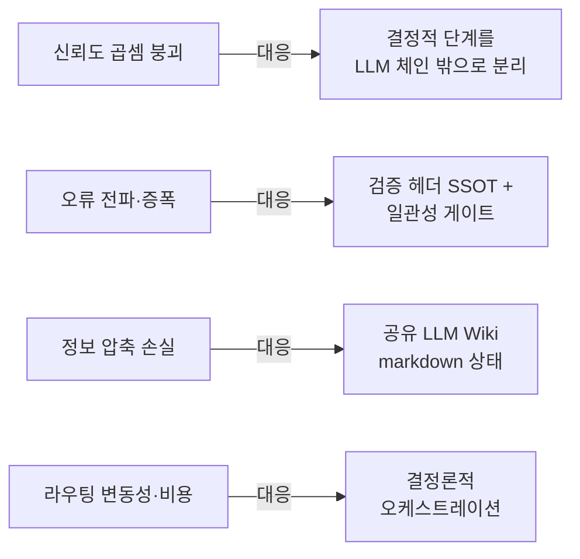
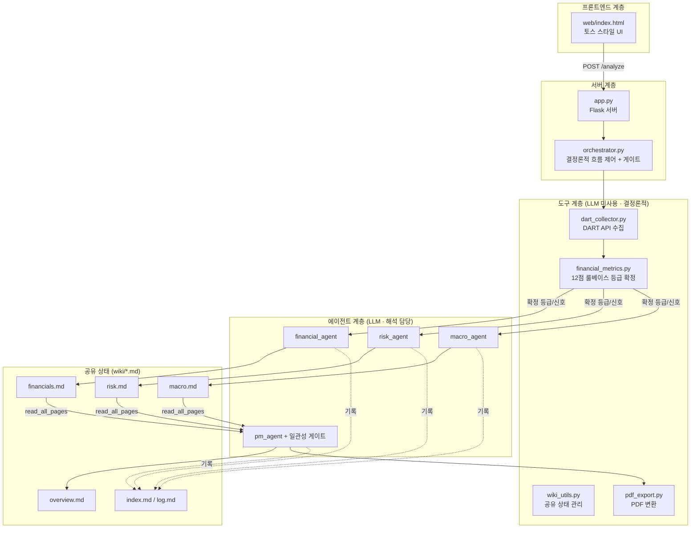
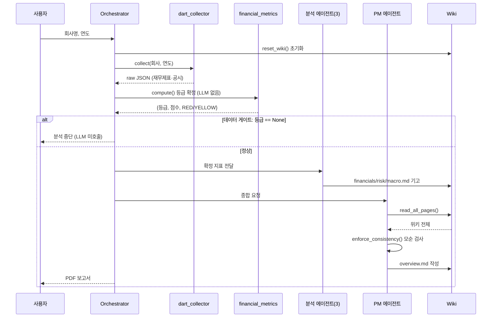
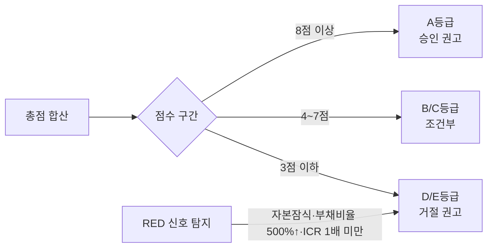
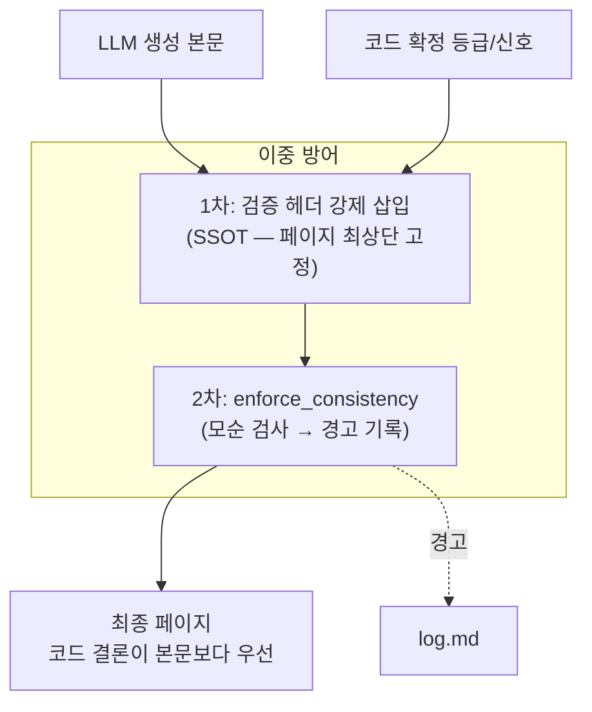
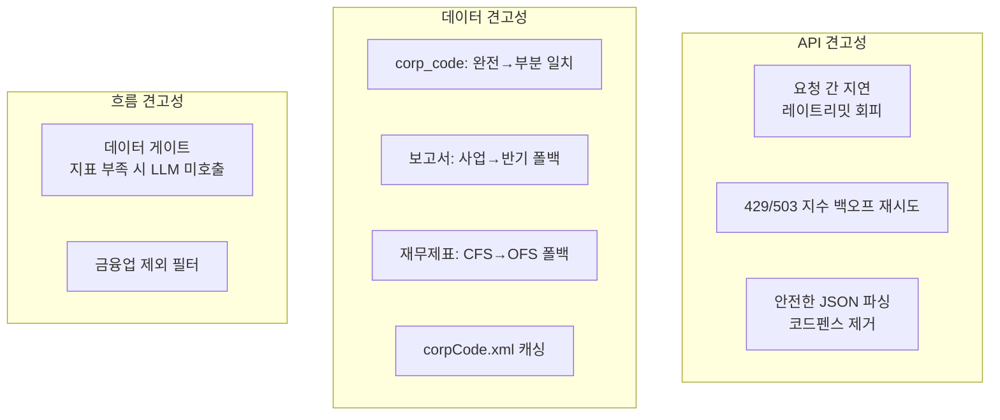
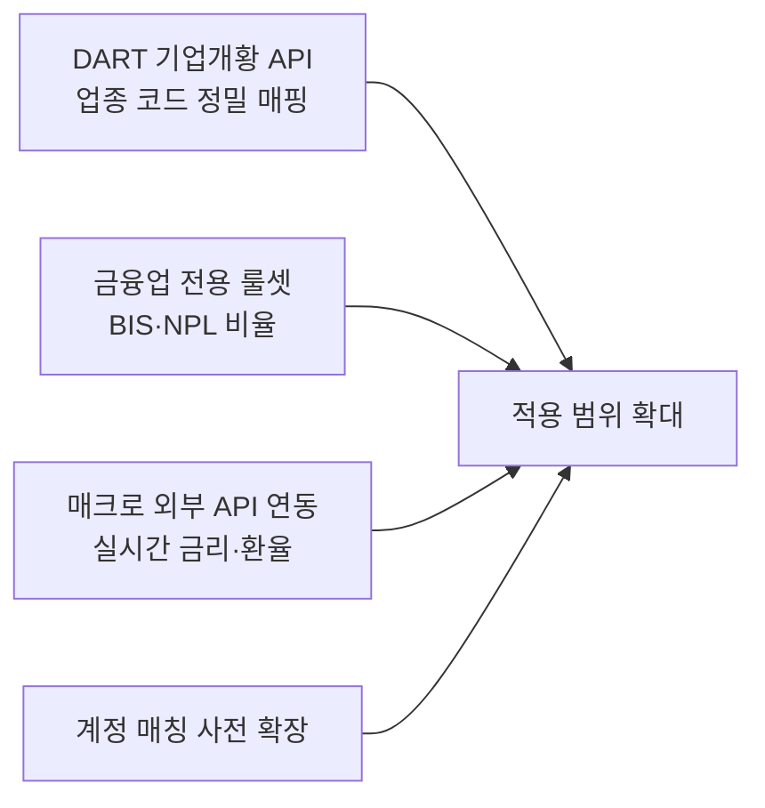

# AI 기업 여신 심사 멀티 에이전트 시스템

### 작성자 : 부산은행 허원재

> DART 전자공시 데이터 기반, **정량 분석(코드)과 정성 분석(LLM)의 권한을 분리**하여 멀티 에이전트의 신뢰도 붕괴를 구조적으로 완화한 여신 심사 보고서 생성 시스템

## 목차

1. 프로젝트 개요와 설계 철학
2. 이론적 배경: 왜 멀티 에이전트는 신뢰도가 무너지는가
3. 시스템 아키텍처
4. 폴더 구조
5. 데이터 흐름
6. 핵심 설계 결정과 근거
7. 정량 평가 룰베이스
8. 프롬프트 엔지니어링 전략
9. 신뢰도 게이트 메커니즘
10. 견고성 설계
11. 실행 방법
12. 검증 결과와 실패 분석
13. 한계와 향후 과제
14. 결론

---

## 1. 프로젝트 개요와 설계 철학

본 프로젝트는 LLM 멀티 에이전트 주제로, 일반적인 AI 워크플로우를 Python으로 재구현하면서 구조적 변형을 가했다. 핵심 변형은 **정량적 의사결정 권한을 LLM 체인에서 분리하여 결정론적 코드에 고정**한 것이다.

### 1.1 설계 철학의 출발점 — 두 가지 안티패턴

본 시스템의 설계는 기존 AI워크플로우에, 두 가지 실패 패턴의 한계를 극복하도록 고려하였다.

**안티패턴 ① "AI가 알아서 추론하길"** — 모호한 명세를 주면 AI는 매번 다른 가정으로 빈칸을 채운다. 예컨대 "회원 등급에 따라 할인"이라고만 적고 등급 정의를 생략하면, AI는 한 번은 GOLD/SILVER/BRONZE를, 다음 세션에는 VIP/REGULAR를 임의로 만든다. AI의 추론은 결정론적이지 않으므로, **추론 구간 자체가 변동성의 진입점**이 된다. 처방은 명확하다. _추론 구간을 0으로 줄여야 한다._ 정의되지 않은 개념을 만나면 자동 추론을 금지하고 확정된 값만 사용해야 한다.

**안티패턴 ② "한꺼번에 시도"** — 여러 구성요소를 동시에 생성하면 그들 사이의 의존 관계가 보장되지 않아 전부 어긋난다. B가 A에 의존하는데 A가 확정되기 전에 B를 만들면 깨진다. 처방은 _의존 단위로 분할하고, 의존 순서로 위상정렬하여 의존이 없는 것(Wave 0)부터 차례대로 생성_하는 것이다.

### 1.2 두 안티패턴에 대한 본 시스템의 대응

위 두 원칙을 본 시스템의 핵심 설계와 대응시켜 일반적인 케이스와 대비해 성능을 개선시켰다.

| 안티패턴                       | 처방           | 본 시스템의 구현                                                                                      |
| -------------------------- | ------------ | ---------------------------------------------------------------------------------------------- |
| ① AI가 알아서 추론 (추론 구간 = 변동성) | 추론 구간을 0으로   | **권한 분리 + 그라운딩**: 등급·점수·신호는 코드가 확정하고, LLM은 추론 없이 확정값만 해석. 프롬프트에 "없는 값은 N/A, 스스로 계산 금지" 하드 제약   |
| ② 한꺼번에 시도 (의존 관계 깨짐)       | 의존 순서로 분할 생성 | **결정론적 오케스트레이션 + 데이터 게이트**: 수집 → 등급 확정 → 분석 에이전트 → PM 종합의 의존 순서를 코드가 고정. 선행 단계 실패 시 후행 LLM 미호출 |

특히 안티패턴 ①에 대한 대응이 본 프로젝트의 정체성이다. 비정량적인 AI의 추론은 "여신 등급(A~E)을 LLM이 매번 다르게 판정하는" 치명적 위험이 된다. 이를 막기 위해 **등급 판정이라는 가장 결정적인 추론을 LLM에서 완전히 제거하고 결정론적 룰베이스 코드로 대체**했다. LLM은 이미 확정된 A등급에 대해 "왜 A인지"를 서술할 뿐, A인지 B인지를 판단하지 않는다. 추론 구간을 0으로 줄인 것이다.

안티패턴 ②에 대해서는, 에이전트들을 임의 순서로 한꺼번에 호출하지 않는다. 재무 지표가 코드로 확정된 **뒤에야** 분석 에이전트들이 그 값을 받아 동작하고, 세 에이전트가 위키에 기고를 마친 **뒤에야** PM 에이전트가 종합한다. 이 의존 순서를 LLM이 아닌 오케스트레이터 코드가 강제하며, 선행 단계가 실패하면(데이터 부재 등) 데이터 게이트가 후행 LLM 호출을 차단한다.

### 1.3 한 문장 요약

본 시스템의 철학은 다음 한 문장으로 압축된다. **"AI의 추론 구간을 0으로 줄이고(숫자·등급은 코드가 확정), 의존 순서를 코드가 강제한다(LLM은 라우팅하지 않는다)."** 이는 곧 다음 장에서 다룰 신뢰도 곱셈 붕괴 문제에 대한 근본적 대응이기도 하다.

---

## 2. 이론적 배경

### 2.1 신뢰도 곱셈 붕괴 (Multiplicative Trust Decay)

에이전트를 직렬로 연결하면 종단 신뢰도는 각 에이전트 신뢰도의 곱으로 감소한다. 각 에이전트가 개별적으로 95%의 정확도를 가진다고 가정하면, 에이전트 수에 따른 종단 신뢰도는 다음과 같이 급격히 하락한다.




6개 에이전트를 직렬 연결하면 0.95⁶ ≈ 73.5%로, 네 번 중 한 번꼴로 종단 오류가 발생한다. 더 심각한 문제는 **오류가 독립적이지 않다는 점**이다. 상류 에이전트의 잘못된 출력은 하류로 전파되며 증폭된다.

### 2.2 정보 압축 손실

에이전트 경계마다 풍부한 내부 상태가 좁은 계약(JSON, top-5 evidence 등)으로 압축되면서 맥락이 손실된다. 본 시스템은 이를 **공유 Markdown Wiki 개념**으로 완화해보았다.

### 2.3 본 시스템의 대응 전략



가장 결정적인 단계(등급 확정)를 LLM 체인 밖으로 빼내 코드에 고정하면, 그 단계의 신뢰도는 100%로 유지된다. 곱셈 항에서 가장 중요한 인자를 1.0으로 만드는 것이 핵심 전략이다.

---

## 3. 시스템 아키텍처

본 시스템은 4개의 LLM 에이전트와, 이들을 통제하는 결정론적 코드 계층으로 구성된다.



핵심은 **정량 흐름(DART 수집 → 등급 확정)이 LLM을 전혀 거치지 않는다**는 점이다. 등급이 코드로 확정된 뒤에야 LLM 에이전트가 등장한다.

---

## 4. 폴더 구조

```
dart-loan-review/
│
├── app.py                  # Flask 로컬 서버 (웹 진입점)
├── main.py                 # CLI 진입점
├── orchestrator.py         # 결정론적 파이프라인 제어 + 게이트
├── config.py               # 환경 설정 (API 키, 경로, 모델, 레이트리밋)
├── llm_client.py           # Gemini api 래퍼 (재시도·레이트리밋·JSON 파싱)
│
├── web/
│   └── index.html          # UI 입력 프론트
│
├── tools/                  # ── 결정론적 도구 (LLM 미사용) ──
│   ├── dart_collector.py   # DART API 수집 -> raw 저장
│   ├── financial_metrics.py# 12점 룰베이스 정량 평가 (등급 확정)
│   ├── wiki_utils.py       # 공유 위키 읽기/쓰기/로그/인덱스
│   └── pdf_export.py       # markdown → PDF 변환
│
├── agents/                 # ── LLM 에이전트 (해석 담당) ──
│   ├── financial_agent.py
│   ├── risk_agent.py
│   ├── macro_agent.py
│   └── pm_agent.py         # 최종 종합 + 일관성 강제
│
├── prompts/                # ── 프롬프트 별도 분리/관리 ──
│   ├── schema.md           # [공통] 위키 작성 규칙 + 정량값·등급 변경 금지 정의
│   ├── financial_prompt.md # [재무] 코드 계산 지표 해석만 허용, 수치 생성 금지
│   ├── risk_prompt.md      # [리스크] 보수적 점검, 낙관 편향 경계, 감점·N/A 짚기
│   ├── macro_prompt.md     # [매크로] 거시 수치 작성
│   └── pm_prompt.md        # [PM] 8섹션 종합, 코드 확정 결론과 일치 강제
│   #
│   # ※ 공통 3원칙: 그라운딩(주어진 데이터만 사용) / 권한 제약(코드 확정값 변경 금지)
│   #              / 불확실성 표기(단정 대신 가능성 표현)
│
├── wiki/                   # ── 공유 상태 저장소 (실행 시 자동 생성) ──
│   ├── financials.md       # 재무 에이전트 기고 (정량 지표 해석)
│   ├── risk.md             # 리스크 에이전트 기고 (위험 신호·공시 점검)
│   ├── macro.md            # 매크로 에이전트 기고 (거시·업종 분석)
│   ├── overview.md         # PM 에이전트 최종 종합 보고서 (8섹션)
│   ├── index.md            # 위키 페이지 목록 (자동 갱신)
│   └── log.md              # 에이전트 작업 추적 로그 (시간순)
│
├── raw/                    # DART 원본 데이터 json (입력 캐시)
├── output/                 # 최종 분석 보고서 PDF (제출 산출물)
│
├── .env / .env.example / .gitignore
└── README.md

```

`tools/`(LLM 미사용)와 `agents/`(LLM 사용)의 물리적 분리가 곧 "정량은 코드, 정성은 LLM"이라는 권한 분리 철학의 구조적 표현이다.

---

## 5. 데이터 흐름



등급 확정이 실패하면(데이터 부재 등) 비싼 LLM 호출을 건너뛰고 즉시 중단한다(데이터 게이트).

---

## 6. 핵심 설계 결정과 근거

|설계 결정|기각한 대안|선택 근거|
|---|---|---|
|정량 결론은 코드가 확정, LLM 변경 불가|LLM이 확률을 재해석|신뢰도 곱셈 항의 핵심 인자를 1.0으로 고정|
|결정론적 오케스트레이션|LLM 오케스트레이터|라우팅 변동성·비용 제거, 디버깅 용이|
|공유 LLM Wiki (markdown)|에이전트 간 JSON 직접 전달|정보 압축 손실 완화, 작업 추적 투명성|
|프롬프트 외부 파일 분리|코드 내 하드코딩|버전 관리·검토 용이, 채점자 가독성|
|실행마다 위키 초기화|누적 보존|회사 간 데이터 오염 방지 (PDF는 별도 보존)|
|데이터 게이트(IF-ELSE)|항상 LLM 호출|부실 데이터 시 비용·오류 차단|
|금융업 명시적 제외|모든 업종 동일 룰 적용|룰베이스 적용 범위 한정 (12장 참조)|

---

## 7. 정량 평가 룰베이스

등급은 6개 지표의 가중 합산으로, **전적으로 코드가** 결정한다.

|지표|계산식|가중치|의미|
|---|---|---|---|
|이자보상배율(ICR)|영업이익 ÷ 이자비용|3점|이자 감당 능력|
|부채비율|부채총계 ÷ 자본총계|2점|재무 레버리지|
|3개년 수익성|최근 3년 적자 연수|2점|수익 지속성|
|매출성장률|(당기-전기) ÷ 전기|2점|성장 모멘텀|
|유동비율|유동자산 ÷ 유동부채|1점|단기 상환력|
|차입금의존도|총차입금 ÷ 자산총계|1점|외부 자금 의존도|



### 이자비용 처리의 실무 함정 (검증 중 발견)

삼성전자 보고서 작성 검증에서, 손익계산서에 이자비용이 직접 표기되지 않는 경우가 많음을 확인했다. 이에 폴백 매칭을 적용했다.

```python
# 이자비용: 현금흐름표 '이자의 지급' 우선 → 없으면 금융비용 폴백
interest = (
    find_account("InterestPaidClassifiedAsOperatingActivities")  # 0.84조
    or find_account("FinanceCosts")                              # 12.6조
)
```

두 값의 차이가 ICR을 **7.8배(이자지급 기준) vs 0.52배(금융비용 기준)** 로 가른다. 계정 매칭의 정확성이 등급을 좌우함을 보여주는 사례다.

---

## 8. 프롬프트 엔지니어링 전략

프롬프트는 5개 파일로 분리되며, 각각 의도된 기법이 적용되어 있다.

|프롬프트|핵심 기법|목적|
|---|---|---|
|schema.md|시스템 지침 · 그라운딩|공통 규칙(코드 숫자만, 등급 변경 금지)|
|financial_prompt.md|역할 부여 · 출력 형식 제약|확정값만 해석, 수치 환각 차단|
|risk_prompt.md|낙관 편향 억제|감점·N/A를 반드시 리스크로 명시|
|macro_prompt.md|불확실성 표기 · 업종 추론 가드|거시 환각 방지, 업종은 사실 범위 내 판단|
|pm_prompt.md|하드 제약 · 8섹션 구조 고정|등급 그대로 인용, 모순 표현 차단|

**그라운딩(grounding)** 이 모든 프롬프트를 관통하는 핵심이다. 아래는 financial_prompt.md의 하드 제약 발췌다.

```markdown
# 절대 규칙 (위반 시 실패)
1. [확정 데이터]의 숫자, 등급, 위험 신호를 절대 바꾸지 않는다.
2. 새로운 수치를 스스로 계산하거나 추정하지 않는다.
3. [확정 데이터]에 없는 값은 "데이터 없음(N/A)"으로만 언급한다.
```

또한 에이전트별 **차등 그라운딩**을 적용했다. 재무 에이전트는 확정 숫자에 엄격히 묶고, 매크로 에이전트는 거시 수치는 외부 입력만 쓰되 업종 해석은 일반 상식 범위에서 허용한다.

---

## 9. 신뢰도 게이트 메커니즘

LLM이 정량 결론을 뒤집지 못하게 하는 **이중 방어**가 본 시스템의 기술적 핵심이다.



### 1차 방어: 검증 헤더 (SSOT)

모든 에이전트 페이지 최상단에 코드 확정값을 인용 블록으로 강제 삽입한다.

```python
def _build_verified_header(metrics: dict) -> str:
    signals = metrics.get("risk_signals", [])
    return (
        f"> **[코드 확정 사실 — 변경 불가]**\n"
        f"> 등급: {metrics['grade']} | 총점: {metrics['total_score']}/12 | "
        f"위험 신호: {', '.join(signals) if signals else '없음'}\n"
        f"> (출처: 코드 계산, 본 결론이 본문보다 우선한다)"
    )
```

### 2차 방어: 일관성 강제

PM 출력에 대해 코드가 모순을 검사한다.

```python
def enforce_consistency(report, metrics):
    warnings = []
    signals = metrics.get("risk_signals", [])
    # RED 신호가 있는데 무조건 승인을 말하면 모순
    if signals and "승인 권고" in report and "조건부" not in report:
        warnings.append("위험 신호 존재하나 본문이 승인 시사 — 검토 필요")
    # 확정 등급과 다른 등급 단정 표현 탐지
    for g in {"A","B","C","D","E"} - {str(metrics.get("grade"))}:
        if f"{g}등급으로 평가" in report:
            warnings.append(f"확정 등급과 다른 '{g}등급' 단정 감지")
    return prepend_verified_block(report, metrics), warnings
```

이 덕분에 LLM이 환각으로 "A등급은 과대평가"라고 써도, 최종 결론은 코드가 확정한 A등급으로 고정되고 경고는 log.md에 남는다.

---

## 10. 견고성 설계



실제 매크로 에이전트 실행 중 **503 과부하 오류가 발생했으나 백오프 재시도가 자동 복구**한 사례를 검증했다(로그: `[LLM] 503 한도/과부하. 2초 대기 후 재시도 (1/3)`). 무료 API 환경의 불안정성을 설계에 반영한 결과다.

---

## 11. 실행 방법

```bash
# 1. 의존성 설치
pip install python-dotenv google-genai flask markdown weasyprint

# 2. 환경 설정
cp .env.example .env          # GEMINI_API_KEY, DART_API_KEY 입력

# 3-a. 웹 UI 실행 (권장)
python app.py                 # http://127.0.0.1:5000

# 3-b. CLI 실행
python main.py
```

분석 가능 연도는 DART 재무제표 제공 시작(2015년)부터 정기보고서 공시 완료 연도까지다. 매출성장률 계산을 위해 전년도 데이터가 함께 필요하다.

---

## 12. 검증 결과와 실패 분석

본 시스템의 강건성은 **성공 사례뿐 아니라 실패를 진단하고 개선한 과정**에서 드러난다.

### 12.1 정상 사례 — 삼성전자 (2023)

|항목|결과|
|---|---|
|ICR|7.77배|
|부채비율|25.4%|
|총점 / 등급|8/12 / **A (승인 권고)**|
|위험 신호|없음|
|일관성 경고|0건|

코드 확정 헤더와 LLM 해석 본문이 충돌 없이 결합되었다.

### 12.2 실패 분석 ① — 금융업 룰 부적합 (부산은행)

부산은행(2024)에서 부채비율 1249%, ICR 0.22배로 E등급 거절이 산출되었다. 
**진단 결과 이는 버그가 아니라 룰베이스의 적용 범위 문제였다.**


은행은 예금이 부채로 잡혀 부채비율이 1000%를 넘는 것이 정상이며, 이자비용도 영업의 일부다. 실제 신용평가에서도 금융업은 BIS비율·NPL비율 등 별도 모델을 쓴다. 이를 인지하여 회사명 키워드 기반 금융업 제외 필터를 추가했다. **적용 범위를 명확히 한정하는 것 자체를 설계 원칙으로 채택**했다.

### 12.3 실패 분석 ② — 데이터 부재 처리 (KeyError)

일부 기업에서 `KeyError: 'financials'`가 발생했다. 비상장·비감사 기업이거나 해당 연도 보고서 미제출 시 DART가 빈 결과를 반환하는데, 계산기가 키 존재를 가정해 터진 것이다. 이를 **방어적 반환**으로 개선했다.

```python
financials = raw.get("financials")
if not financials or not financials.get("list"):
    return {"grade": None, "opinion": "데이터 부족", ...}  # 게이트가 잡음
```

이제 코드 에러 대신 데이터 게이트가 작동해 "재무 데이터를 찾을 수 없음"이라는 메시지를 낸다.

### 12.4 검증 종합

|검증 항목|결과|
|---|---|
|우량 기업 정상 등급 산출|통과 (삼성전자 A)|
|위험 신호 탐지 작동|통과 (RED 신호 발동)|
|금융업 부적합 진단·차단|개선 완료|
|데이터 부재 우아한 처리|개선 완료|
|API 503 자동 복구|통과 (백오프 재시도)|
|LLM 결론 변경 차단|통과 (일관성 경고 0건)|

---

## 13. 한계와 향후 과제

본 시스템은 데모이며, **산출되는 등급·심사 의견은 실제 여신·투자 판단의 근거가 될 수 없다.**

구체적 한계로는, 룰베이스가 일반 제조·서비스업을 전제하므로 금융업·지주회사·신생 기업에는 적용되지 않는다. 업종 판단을 회사명 기반 LLM 추론에 일부 의존해 인지도 낮은 기업은 부정확할 수 있다. 매크로 지표는 무료 API 제약으로 실시간이 아닌 고정값을 사용한다. 계정 매칭은 검증된 일부 기업 기준이라 비표준 계정명에서 누락이 발생할 수 있다.

향후 과제는 다음과 같다.



---

## 14. 결론

본 프로젝트는 DART 전자공시 데이터를 기반으로 기업 여신을 심사하는 LLM 멀티 에이전트 시스템을 Python으로 구현했다. 재무·리스크·매크로 분석 에이전트가 공유 위키(markdown)에 기여하고 PM 에이전트가 이를 종합하는 형태로 설계했다. 핵심 설계 원칙은 정량적 의사결정 권한을 LLM 체인에서 분리해 결정론적 코드에 고정하는 것이었다.

구현 과정에서 얻은 가장 큰 교훈은, **멀티 에이전트 시스템의 신뢰도는 개별 에이전트의 똑똑함이 아니라 에이전트 간 경계 설계에서 결정된다**는 점이었다. 신뢰도 곱셈 감소 문제는 추상적 우려가 아니라 실제 위험이었다. 이를 막기 위해 코드가 확정한 등급·점수·위험 신호를 각 위키 페이지 최상단에 '변경 불가' 블록으로 박고, PM 단계에서 일관성을 코드로 강제(enforce_consistency)했다. 그 결과 LLM은 해석과 서술만 담당하고 정량 결론은 절대 뒤집을 수 없는 구조가 만들어졌다.

두 번째 교훈은 **LLM의 환각보다 더 위험한 것은 코드의 조용한 오류**라는 점이었다. 시스템을 여러 기업으로 검증하는 과정에서, LLM이 만들어낸 보고서 문장은 대체로 정확했던 반면, 정작 신뢰의 근간이 되어야 할 정량 계산 코드에 버그가 숨어 있었다. 차입금이 여러 계정에 흩어진 기업에서 일부만 합산되거나(광진실업·부산산업), 무차입 기업이 데이터 부족으로 잘못 처리되거나(리노공업), 이자비용 출처가 기업마다 달라지는 문제가 그것이다. 이 오류들은 등급을 바꿀 수도 있는 시한폭탄이었지만, 코드가 침묵하며 그럴듯한 숫자를 내놓았기에 표면적으로는 드러나지 않았다. 여러 재무 상태의 기업(우량·무차입·차입 적자·대규모 차입)을 실제 데이터로 교차 검증하고 나서야 비로소 소스코드의 오류를 잡을 수 있었다.

세 번째 교훈은 **시스템의 한계를 명확히 긋는 것 자체가 설계의 일부**라는 점이었다. 은행을 입력했을 때 부채비율 1,000%가 RED 신호로 잡히며 무조건 거절이 나온 사례는, 일반기업용 룰베이스를 금융업에 적용하면 안 된다는 것을 보여줬다. 모든 입력을 처리하려 무리하기보다, 적용 범위를 벗어난 입력(금융업 등)을 명시적으로 거절하는 것이 더 정직하고 신뢰할 수 있는 설계임을 배웠다.

이러한 경험을 종합하면, 신뢰할 수 있는 LLM 시스템을 만드는 일은 더 똑똑한 프롬프트를 작성하는 것이라기보다, **LLM이 판단해도 되는 영역과 코드가 책임져야 할 영역을 명확히 나누고, 그 경계를 검증 가능한 형태로 고정하는 일**에 가까웠다. 본 시스템에서 정량은 코드가 확정하고 LLM은 해석만 하며, 라우팅은 결정론적 오케스트레이터가 통제하고, 공유 위키가 정보 손실을 줄이는 구조는 모두 이 원칙의 구현이다.

물론 본 시스템에는 분명한 한계가 있다. 12점 룰베이스는 일반 제조·서비스 기업에 한정되며 금융업에는 적용할 수 없다. 업종 판단은 회사명에 대한 LLM의 추론에 의존하므로 인지도가 낮은 기업에서는 부정확할 수 있으나, 차후 로직만 정해진다면 모든 업종에 대해 범용적으로 보완 가능하다.

결론적으로 이 과제는 멀티 에이전트 시스템에서 'LLM을 얼마나 많이 쓰는가'보다 'LLM에게 무엇을 맡기지 않을 것인가'를 결정하는 일이 더 중요하다는 것을 체득하는 과정이었다. 신뢰도는 에이전트의 수가 아니라 경계의 견고함에서 나온다는 것이 이 프로젝트의 가장 핵심적인 결론이다.
